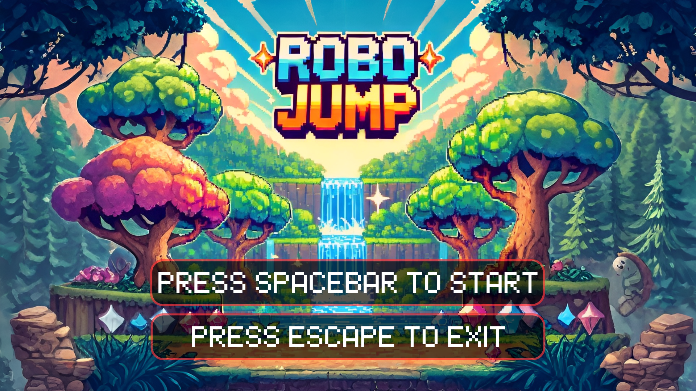
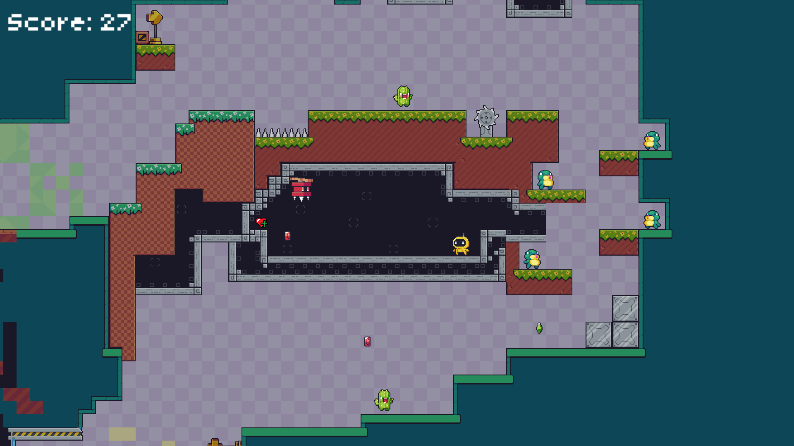

# RoboJump

Welcome to **RoboJump**, a small 2D platformer game built using **SFML** and C++!

## Game Description

In RoboJump, you control a robot navigating through a level divided in 3 zones filled with platforms, enemies, and obstacles. Collect gems and avoid traps and enemies while aiming for victory. Will you reach the end with the maximum score?

## Screenshots





## How to Use / Installation

1. Install [Git](https://git-scm.com/downloads) and [CMake](https://cmake.org/download/). Use your system's package manager if available.
2. Clone the GitHub repo or download it as a zip and extract it.
3. Create an empty "build" folder in the root directory.
4. Use CMake from the command line to generate the game build (if you are on Windows you can use the option of the step 4).
   Be sure to run these commands in the root directory of the game.
   ```
   cmake -B build
   cmake --build ./build
   ```
4. If you are on Windows, you can run ./scripts/build.bat to generate the build.
5. (Optional) If you have Visual Studio 2022 and want to generate the VS solution, execute ./scripts/generate.bat

## Features

- Enemies: Try to avoid being killed by 3 types of enemies: Cactus, Frog and Stomp.
- Gems: Collect different colored gem to increase your score and test yourself to get the maximum score!
- Power ups: Collect up to 2 power ups, extra lives and speed boosts.
- AI: Some enemies have basic player detection so they know when to attack.

## Technical challenges faced in the development

- Class hierarchy: Making a good class hierarchy for some elements of the game has not been easy, specially since some of them are controlled through a manager that must manage them in a generic way.
- Memory usage: To learn about how pointers work and to have better control over them, raw pointers have been used instead of smart pointers.
- Data-driven configuration: Game's info is loaded thanks to some JSON files. That makes easier to change parameters of the game's elements or to add elements. For example, to add a new enemy, just going to the enemies' JSON and adding a new entry is enough, the code must not be changed.

## License

This project is licensed under the MIT License. See LICENSE.md file for full details.